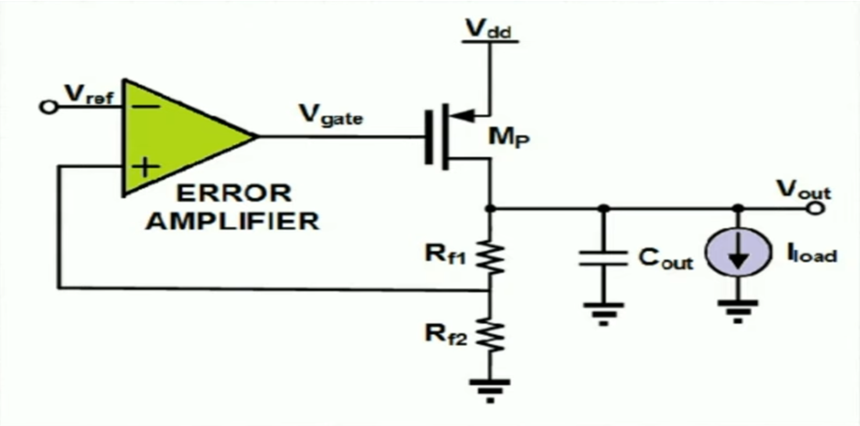
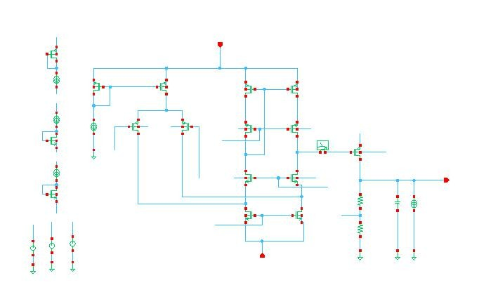
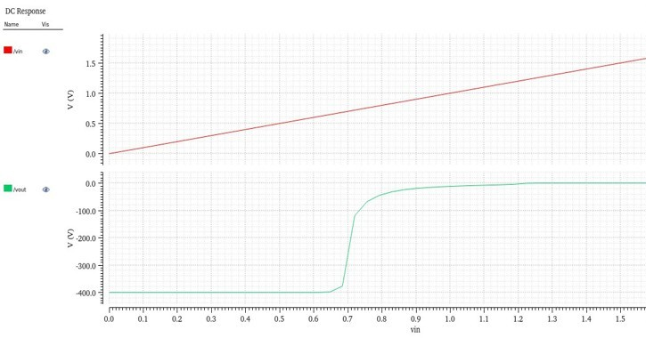
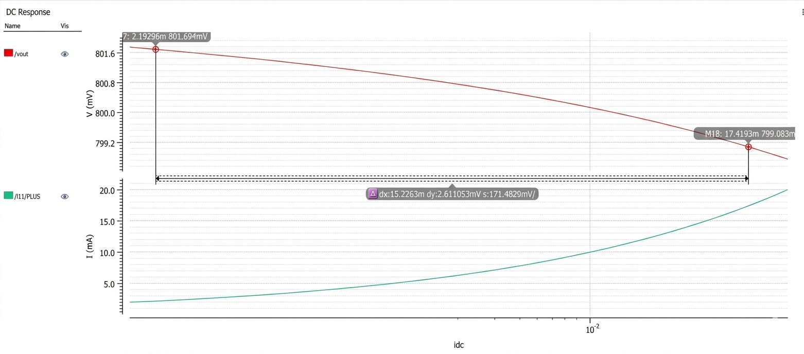
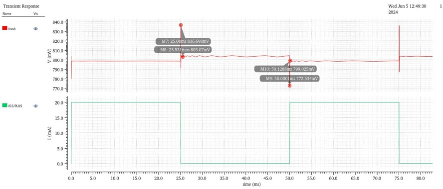
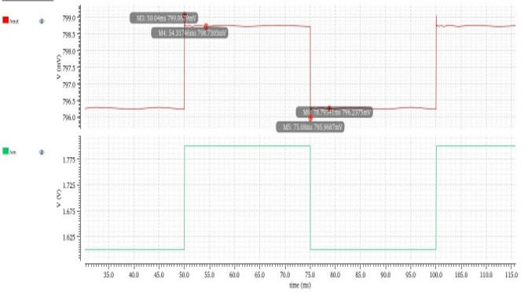

# Low Dropout (LDO) Voltage Regulator

A high-efficiency, low-power **Linear Voltage Regulator** design implemented in a **180nm CMOS technology node**. This regulator delivers a highly stable `0.8V` output voltage from a `1.8V` input supply, ensuring optimal voltage regulation for battery-powered devices and noise-sensitive analog circuits without the use of a power-hungry charge pump.

---

## 📌 Project Overview & Motivation

In conventional Power Management Integrated Circuits (PMICs), such as the classic **7805** linear regulator, power dissipation is a major bottleneck. When the difference between the input supply voltage and the target output voltage is wide, the excess energy is completely dissipated as heat, requiring bulky external heat sinks.

This **Low Dropout (LDO) Regulator** circumvents that overhead by functioning efficiently with an incredibly small input-to-output voltage margin (dropout voltage). 

### Advantages of this Design:
- **Low Power Dissipation:** Minimized voltage drop across the pass element dramatically drops thermal waste.
- **No Heat Sink Required:** Compact silicon real estate footprint ideal for system-on-chip (SoC) integration.
- **Battery-Optimized:** Extended battery runtime due to ultra-low quiescent current draws.

### Why Choose a PMOS Pass Transistor Over NMOS?
1. **Simplified Gate Drive:** A PMOS transistor is driven active by pulling its gate voltage *lower* than its source (\(V_{DD}\)). An Error Amplifier can seamlessly swing its output low to regulate the loop.
2. **Elimination of Charge Pumps:** An NMOS pass transistor requires a gate voltage significantly *higher* than \(V_{DD}\) to stay fully turned on in dropout conditions. Generating this higher internal rail demands a complex, noisy charge pump circuit. Selecting a PMOS topology completely avoids this extra tracking circuitry, lowering layout area and design complexity.

---

## 🛠️ Design Specifications

The circuit is engineered around a 180nm technology process node with the following design parameters:

| Parameter | Symbol | Value | Description |
| :--- | :--- | :--- | :--- |
| **Technology Node** | - | 180 nm | Target CMOS Fabrication Node |
| **Input Supply Voltage** | \(V_{in}\) / \(V_{DD}\) | 1.8 V | Primary unregulated input voltage rail |
| **Output Target Voltage** | \(V_{out}\) | 0.8 V | Highly stable, regulated output rail |
| **Reference Voltage** | \(V_{ref}\) | 0.6 V | Constant voltage provided by Bandgap Reference |
| **Max Load Current** | \(I_{load}\) | 20 mA | Peak driving current capacity under full load |
| **Output Load Capacitor**| \(C_{out}\) / \(C_L\) | 20 nF | Filtering/Stability capacitor tied to output |
| **Feedback Resistor 1** | R₁ | 10 kΩ | Upper resistor in the sampling divider network |
| **Feedback Resistor 2** | \(R_g\) / R₂ | 30 kΩ | Lower grounding resistor in the divider network |

---

## ⚙️ System Architecture & Detailed Working Principle

The LDO operates via a continuous, high-speed **Negative Feedback Loop** designed to counteract sudden load spikes or input line voltage fluctuations.

### 1. Architectural System Block Diagram

---

### 2. Circuit Diagram

Below is the structural circuit realization containing the Error Amplifier block, the PMOS (\(m_p\)) pass element, and the resistor divider configuration:

---

### 3. Feedback Loop Mechanics
- **Sampling:** The resistor divider $R_1$ and $R_2$ continuously samples a scaled fraction of the output voltage $V_{out}$ to output a Feedback Voltage $V_{FB}$.
- **Comparison:** The Error Amplifier operates as the control core of the system. It maps the error tracking profile by comparing $V_{FB}$ against the stable reference voltage $V_{ref} = 0.6V$.
- **Negative Feedback Regulation Action:**
  - **Case A: Output Voltage Decreases ($V_{FB} < V_{ref}$):** If a sudden current draw causes $V_{out}$ to dip, $V_{FB}$ drops beneath $V_{ref}$. The Error Amplifier instantly detects this delta and drives its output gate voltage $V_{gate}$ **lower**. Pulling the PMOS gate lower drives it **ON more heavily**, which pushes a burst of supply current from the input to the output to restore $V_{out}$ back to its steady-state target of 0.8V.
  - **Case B: Output Voltage Increases ($V_{FB} > V_{ref}$):** If the load requirements lighten up, $V_{out}$ scales upward, pushing $V_{FB}$ higher than $V_{ref}$. The Error Amplifier reacts by driving the PMOS gate voltage $V_{gate}$ **higher**. This turns the PMOS transistor **ON less**, dropping the source-to-drain current flow and lowering $V_{out}$ perfectly back down to 0.8V.

---

## 📊 Simulation Analysis & Performance Waveforms

To thoroughly evaluate loop stability, regulation precision, and response times, DC analysis and transient analysis testbenches were simulated.

### 1. Line Regulation (DC Analysis)
* **Objective:** Measures the LDO's resilience to maintain a locked output voltage $V_{out}$ when the input power supply $V_{in}$ exhibits significant swinging variations.
* **Mathematical Formula:** 
  $$\text{Line Regulation} = \frac{\Delta V_{out}}{\Delta V_{in}}$$
* **Result:** **`12 mV/V`**
* **Analysis:** This indicates outstanding regulation; for an entire 1.0 Volt jump at the input rail, the regulated output changes by a mere 12 millivolts.

---

### 2. Load Regulation (DC Analysis)
* **Objective:** Assesses the design's capability to provide a flat output voltage profile $V_{out}$ when the load demand $I_{load}$ surges across its total operational boundary.
* **Mathematical Formula:** 
  $$\text{Load Regulation} = \frac{\Delta V_{out}}{\Delta I_{out}}$$
* **Result:** **`0.15 mV/mA`**
* **Analysis:** For every 1 milliamp change in output current demand, the output voltage drops or shifts by only 0.15 millivolts, showcasing excellent loop gain tracking.

---

### 3. Load Transient Response (Transient Analysis)
* **Objective:** Checks dynamic transient speed when the load current experiences near-instantaneous step changes. This evaluates stability limits such as dampening, ringing, and tracking recovery speed.

#### Measured Parameters:
- **Undershoot:** `26.49 mV` *(The momentary voltage sag observed immediately following a sharp step-up change in load current)*.
- **Overshoot:** `32.19 mV` *(The brief voltage spike that manifests right after a sudden step-down decrease in load current)*.
- **Settling Time:** **`10.9 µs`** *(The total elapsed duration required for the internal feedback loop to dampen out the disturbance and guide the output back into its normal regulated threshold)*.

---

